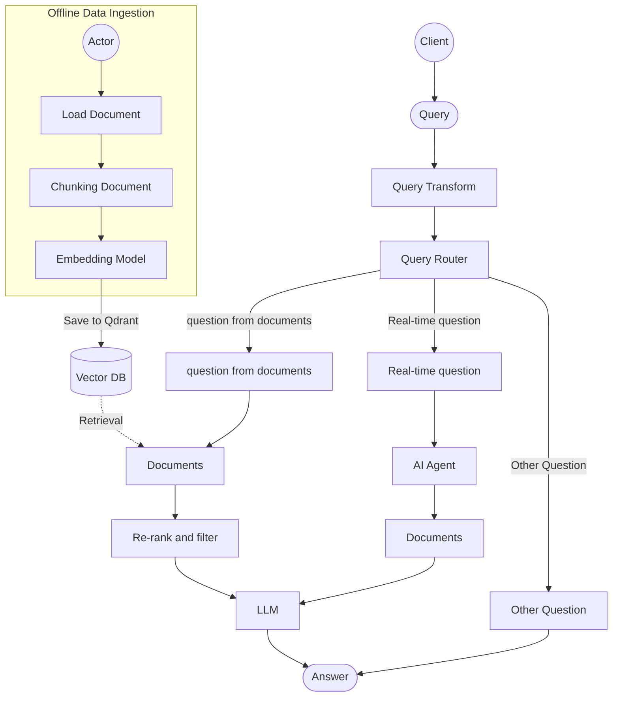

# Advanced Enterprise RAG Chatbot

Hệ thống Chatbot RAG (Retrieval-Augmented Generation) thông minh, được thiết kế để xử lý đa luồng câu hỏi, hỗ trợ giao diện Web trực quan và tích hợp sâu với các mô hình ngôn ngữ tiên tiến của Google và HuggingFace.

## Sơ đồ Kiến trúc Hệ thống

Dưới đây là sơ đồ luồng hoạt động (Workflow) của hệ thống, bao gồm quá trình Nạp dữ liệu (Offline Ingestion) và quá trình Truy vấn thời gian thực (Online Querying):



## Frameworks sử dụng

Dự án này được xây dựng trên một stack công nghệ hiện đại và chuyên nghiệp:

### 1. Xử lý Logic & Orchestration
- **[LangChain](https://python.langchain.com/)**: Bộ khung lõi (Core Framework) điều phối toàn bộ luồng RAG, khởi tạo LLM, kết nối VectorDB và thiết kế Agent thông minh.
- **[LlamaIndex](https://www.llamaindex.ai/)**: Sử dụng `SimpleDirectoryReader` chuyên biệt để đọc, bóc tách và tiền xử lý nhiều định dạng tài liệu phức tạp (PDF, Text, Hình ảnh đa phương thức).

### 2. Mô hình AI (Models)
- **Google Gemini (`gemini-2.5-flash`)**: Làm bộ não chính (LLM) để tổng hợp, suy luận và tạo ra câu trả lời cuối cùng, tối ưu cho tốc độ và khả năng hiểu ngữ cảnh.
- **HuggingFace Sentence-Transformers**: 
  - **Embedding**: Sử dụng `all-MiniLM-L6-v2` để chuyển đổi văn bản thành vector (384 chiều).
  - **Re-ranking**: Sử dụng Cross-Encoder (`ms-marco-MiniLM-L-6-v2`) để chấm điểm và sắp xếp lại mức độ liên quan của các tài liệu sau khi Retrieval, tăng tính chính xác tuyệt đối.

### 3. Cơ sở dữ liệu Vector (Vector Database)
- **[Qdrant](https://qdrant.tech/)**: Vector DB siêu tốc độ để lưu trữ, index và tìm kiếm các Embeddings. Chạy trực tiếp ở chế độ Local (lưu thư mục `VectorDB`).

### 4. Backend Server & Web UI
- **[FastAPI](https://fastapi.tiangolo.com/) & Uvicorn**: Xây dựng máy chủ RESTful API bất đồng bộ siêu nhanh, mạnh mẽ, phục vụ trực tiếp Web UI.
- **Pydantic**: Ràng buộc dữ liệu (Data Validation) chặt chẽ cho Request/Response.
- **HTML / CSS / Vanilla JS**: Giao diện người dùng Web Chat trực quan, mượt mà (hỗ trợ Dark Mode, render Markdown).

### 5. Triển khai (Deployment)
- **[Docker](https://www.docker.com/)**: Đóng gói toàn bộ ứng dụng (containerized) thành Image thông qua `Dockerfile`, đảm bảo tính ổn định và tính chuyên nghiệp khi mang lên môi trường Production.

---

## Cài đặt & Sử dụng (Môi trường Local)

### 1. Chuẩn bị
Yêu cầu: `Python 3.10+`.
Bản sao dự án về và cài đặt thư viện:
```bash
pip install -r requirements.txt
```

Cấu hình API Key: Tạo file `.env` ở thư mục gốc:
```env
GOOGLE_API_KEY=your_gemini_api_key_here
```

### 2. Nạp tài liệu vào hệ thống (Ingestion)
Bỏ các file dữ liệu (.pdf, .txt...) vào thư mục `data/` rồi chạy lệnh:
```bash
python app/service/ingest.py
```
*(Hệ thống sẽ tiến hành đọc, chunking, nhúng (embedding) và lưu vào Qdrant tại thư mục `VectorDB/`)*

### 3. Khởi chạy Web Chatbot
Bạn có thể chạy trực tiếp bằng Terminal CLI:
```bash
python main.py
```
Hoặc bật **Web UI** bằng FastAPI:
```bash
python api.py
# Truy cập: http://localhost:8000
```

---

## Triển khai bằng Docker (Production)

Để chạy dự án một cách chuyên nghiệp và độc lập, hãy sử dụng Docker.

**Build Image:**
```bash
docker build -t rag-chatbot-app .
```

**Run Container:**
```bash
docker run -d -p 8000:8000 \
  --env-file .env \
  -v $(pwd)/data:/app/data \
  -v $(pwd)/VectorDB:/app/VectorDB \
  --name rag-container \
  rag-chatbot-app
```
*Truy cập UI Chatbot tại: `http://localhost:8000`*
